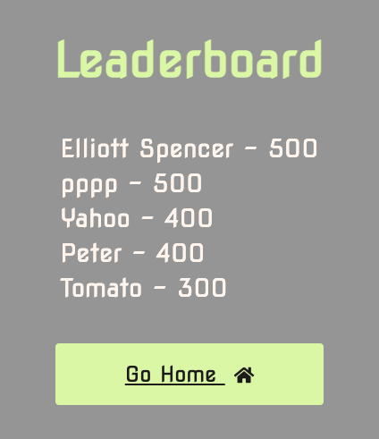

# Code Quiz - Homework 4, UW Coding Bootcamp

## Description

For the fourth week of the UW Coding Bootcamp my homework invited me to build a timed coding quiz with multiple-choice questions. The app I built runs in the browser and features dynamically updated HTML and CSS powered by JavaScript code. It has a clean, polished, and responsive user interface and includes a count down timer, a results page to save your score, and a highscores page which will track the top 5 heighest scores using local storage.

## Built With

* [HTML](https://github.com/spencee1315/hw_wk4)

## Deployed Link

* [See Live Site](https://spencee1315.github.io/hw_wk4/)

## Preview of Working Site




## Code Snippet
This code snippet...........

```javascript 

// Timer - will load on page load (once the start button is clicked on the index page) and start the countdown of the first question
// Global Variable, setting outside timer function to call it in the getNewQuestion function
let sec 
function timer(){
    sec = 10;
    const timer = setInterval(function(){
        sec--;
        document.getElementById('timer-count').innerHTML=''+sec;
        if (sec < 0) {
            // Advances to new question at -1, so zero will populate on screen
            getNewQuestion();
        }
    }, 1000);
}

timer()
```

### Authors

* **Elliott Spencer**

### Contact Information

* [Link to Portfolio Site](https://spencee1315.github.io/hw_wk2/)

* [Link to Github](https://github.com/spencee1315)

* [Link to LinkedIn](https://www.linkedin.com/in/elliott-spencer-886a9818/)
